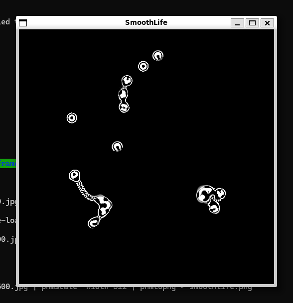

# smoothlife

This is just a basic implementation of the SmoothLifeL automaton, using
thresholds cribbed from the Youtube video at:

http://www.youtube.com/watch?v=KJe9H6qS82I

I wrote it during a lunch hour over a decade ago, and never went back in
to tidy it up, so expect it to be rough.

It uses the fftw library to quickly integrate the weights over the grid,
and then uses SDL2 to write each frame to the screen.   It was originally
just dumping frames to individual files, the bones of which can still 
be seen in the code.
